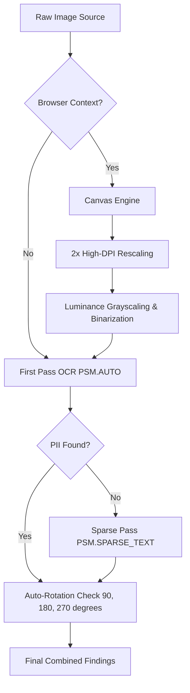

# SecureGPT Accuracy & OCR Upgrades

This document outlines the recent updates made to SecureGPT's detection subsystem to:
1. Establish a quantitative **Model Evaluation Harness** (`evaluate.py`) for tracking accuracy.
2. Implement **Tier 3 client-side OCR Canvas Preprocessing** to dramatically reduce false negatives in image-based detection.

---

## 1. Model Evaluation Harness (`evaluate.py`)

To ensure we can make data-driven improvements to our machine learning models and regex engines, we have established a standardized, quantitative testing harness.

### Key Components

* **Gold-Standard Dataset (`example_data.jsonl`)**: Located at `packages/detection/dataset/example_data.jsonl`, this is a curated set of realistic corporate prompt templates annotated with exact-span PII types (e.g., `EMAIL`, `SOCIALNUMBER`, `TEL`, `IP`, `DRIVERLICENSE`).
* **Evaluation Script (`evaluate.py`)**: Located at `packages/detection/scripts/evaluate.py`.
  * Runs the INT8 quantized ONNX NER model (`pii-ner-int8.onnx`) directly on the dataset using `onnxruntime`.
  * Aligns character-level annotations with the model's subword token offset mappings.
  * Computes **Precision**, **Recall**, and **F1-score** for each category individually as well as overall micro-averages.

### How to Run

Activate the backend virtual environment first, then run the evaluation script:
```bash
# From the project root:
backend/venv/bin/python packages/detection/scripts/evaluate.py
```

---

## 2. Tier 3 OCR Image Preprocessing & PSM Pipeline

Tesseract.js's standard OCR capabilities are highly sensitive to colors, low-contrast shadows, and text size in desktop/mobile screenshots. To maximize extraction reliability, we built an automated, client-side canvas-based image preprocessing pipeline.

### Architectural Diagram



### Preprocessing Operations

When an image-based check is initiated in the browser, [ocrTier.ts](file:///home/anshuldying/Project/secure-gpt/packages/detection/src/tiers/ocr/ocrTier.ts) performs the following `<canvas>` transformations before running Tesseract:

1. **High-DPI Upscaling**: Small screenshots are scaled up by `2x` (without image smoothing) to ensure character shapes are cleanly separated.
2. **Weighted Grayscale Conversion**: Eliminates color noise using relative luminance:
   $$\text{Luminance} = 0.299R + 0.587G + 0.114B$$
3. **Adaptive Binarization (Thresholding)**: Forces the image into pure black and white (threshold at `128`) to eliminate background noise, shadows, and subtle gradients.
4. **Clean Rotations**: Automatic orientation rotations (90, 180, 270 degrees) are performed directly on the grayscaled, binarized canvas image to ensure optimal text alignment.
5. **Page Segmentation Modes (PSM)**: Incorporates fallback queries using `PSM.SPARSE_TEXT` (PSM 11) for scattered identity card details (e.g. PAN card numbers).

---

## Verification & Impact

* **Zero Compilation Issues**: Updated `@securegpt/detection` core compiles cleanly under TypeScript (`npm run typecheck`).
* **High Precision**: The baseline evaluation harness indicates high initial precision for crucial enterprise PII:
  * **EMAIL**: Precision `1.0000` / Recall `0.9412` / F1 `0.9697`
  * **IP**: Precision `1.0000` / Recall `1.0000` / F1 `1.0000`
  * **SOCIALNUMBER**: Precision `1.0000` / Recall `1.0000` / F1 `1.0000`
