# SecureGPT Architecture (Deep Technical Reference)

This document explains how SecureGPT works end-to-end across:

1. browser extension runtime (content, background, offscreen, popup),
2. local detection engine (Regex + NER + OCR tiers),
3. backend API (FastAPI + SQLAlchemy + session auth),
4. dashboard app (Next.js + proxy/BFF auth callback pattern),
5. shared type and contract layer (`@securegpt/shared`).

It is written against the current code in this repository, not a conceptual future state.

---

## 1. Monorepo layout and responsibility boundaries

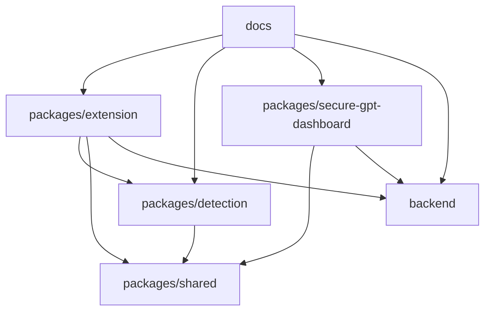

### 1.1 Package responsibilities

- **`packages/extension`**: Chrome MV3 extension. Intercepts prompt/file submission, delegates detection, applies block/mask/warn actions, and uploads anonymized audit events.
- **`packages/detection`**: Local detection engine used by extension/offscreen contexts. Implements tiered detection pipeline.
- **`packages/shared`**: shared types/constants/utilities used by extension, detection, and dashboard.
- **`packages/secure-gpt-dashboard`**: admin/user dashboard with policy, logs, alerts, and auth UI.
- **`backend`**: session-auth API for auth, policy, logs, alerts, devices, and redaction.
- **`infra`**: currently present but files are placeholders (empty at the moment).

---

## 2. System context (runtime actors and trust boundaries)

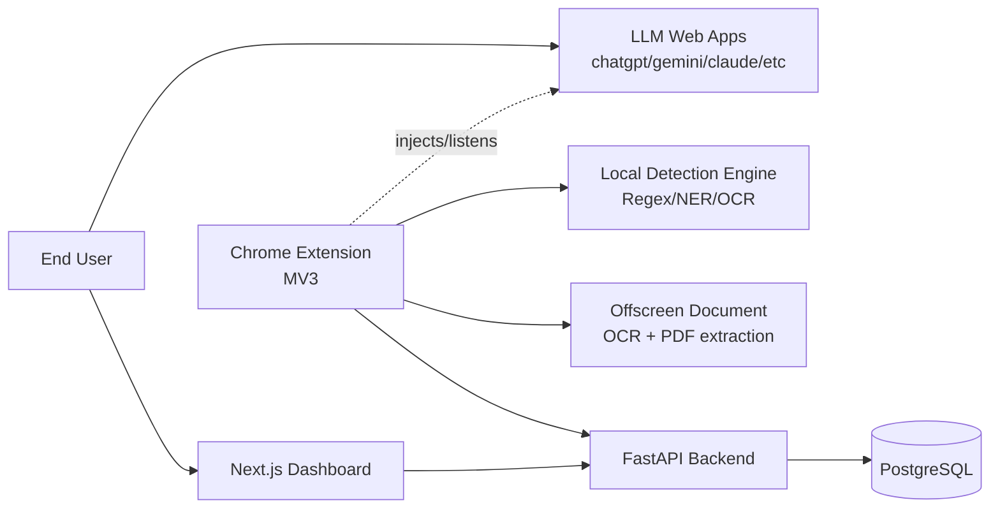

### 2.1 Security intent by boundary

- **User content boundary**: detection and masking are performed locally in extension runtime before prompt leaves browser page.
- **Network boundary**: backend receives metadata/audit events and policy state; raw prompt text is intentionally not required for normal event ingestion.
- **Auth boundary**: session cookie (`sgpt_session`) governs dashboard/backend auth; extension calls include `X-Extension-Request: true` for service-worker fingerprint bypass.

---

## 3. Extension architecture (MV3)

Primary extension modules:

- `src/content/*`: interception and action enforcement inside LLM pages.
- `src/background/*`: policy sync, log batching, message router, OCR/PDF orchestration.
- `src/offscreen/offscreen.ts`: OCR/PDF runtime endpoint.
- `src/popup/*`: user-facing extension popup.
- `src/lib/storage/storage.ts`: local state/auth/policy/session metrics persistence.
- `public/manifest.json`: extension capabilities and host scopes.

### 3.1 Extension component diagram

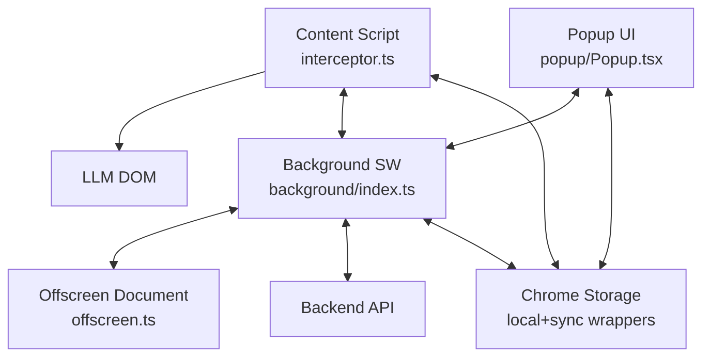

### 3.2 Manifest/runtime mechanics

From `public/manifest.json`:

- MV3 service worker: `background/index.js`.
- content scripts injected on supported LLM hosts (ChatGPT, Gemini, Copilot, Claude, Perplexity, Meta AI).
- permissions include `storage`, `offscreen`, `tabs`, `scripting`, `activeTab`.
- web-accessible resources expose offscreen HTML, assets, models, wasm.

### 3.3 Prompt interception and action enforcement

Core logic: `src/content/interceptor.ts`.

Interception points:

- Enter key (`keydown` capture)
- Send-button click
- Form submit
- paste / file input change / drag-drop for images and PDFs

Action resolution:

- Entities from text detection + OCR cache are combined.
- Policy action precedence is strict: `BLOCK > MASK > WARN_ALLOW > ALLOW`.
- Applies:
  - **BLOCK**: stop submit + banner.
  - **MASK**: replace text and redact attached assets, then resubmit.
  - **WARN_ALLOW**: modal decision (mask-and-send or send-directly).
  - **ALLOW**: pass-through with audit logging.

### 3.4 Text submit runtime sequence

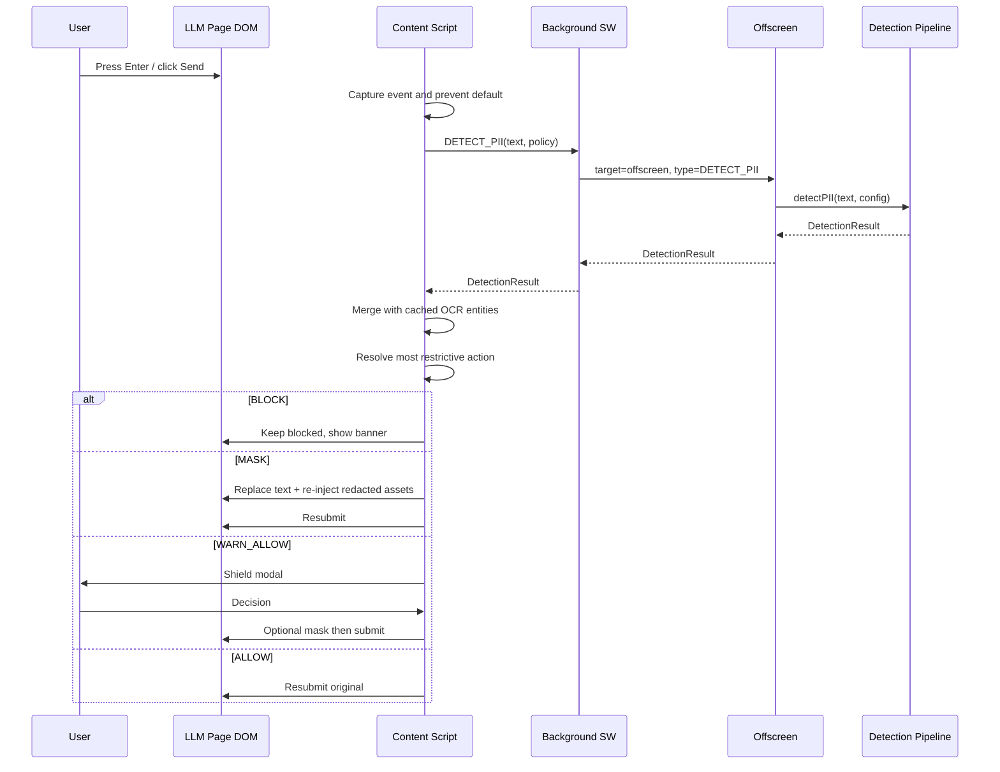

### 3.5 Image/PDF flow and offscreen responsibilities

Offscreen (`src/offscreen/offscreen.ts`) handles:

- `OFFSCREEN_PING`: readiness check.
- `OFFSCREEN_RUN_OCR`: OCR extraction + detection mapping.
- `OFFSCREEN_RUN_PDF`: PDF text extraction via `pdfjs-dist`.
- `OFFSCREEN_GET_PDF_REGIONS`: map text values to positional regions for redaction.
- text detection pass-through (`target: offscreen`, `type: DETECT_PII`).

### 3.6 Logging and policy sync in background

- `background/policy-sync.ts` polls `/api/v1/extension/policy` every 30s (after immediate startup call).
- `background/log-batcher.ts` buffers events in local storage and flushes on interval or max batch size.
- API client (`src/lib/api/client.ts`) always sends:
  - `withCredentials: true`
  - `X-Extension-Request: true`

### 3.7 Extension auth model

- Extension opens dashboard OAuth entry (`/api/v1/auth/google`) through dashboard origin.
- Session identity in extension is represented by cached user profile in storage, while backend trust remains cookie-based.
- Extension auth service uses dashboard-origin requests to align cookie scope with dashboard/backend flow.

---

## 4. Detection engine architecture (`packages/detection`)

## 4.1 Core pipeline behavior

Primary entrypoint: `src/pipeline.ts`.

Pipeline logic:

1. initialize enabled tiers once,
2. run Regex tier on input text,
3. mask Regex spans with spaces before NER tier,
4. run NER on masked text,
5. merge tier outputs with overlap precedence,
6. apply allowlist filtering from policy,
7. return `DetectionResult` with highest tier used.

Separate image entrypoint:

- `detectPIIFromImage(imageData, config)`:
  - OCR extract text + metadata,
  - run Regex and NER on extracted text,
  - map merged entities to image bounding boxes,
  - apply allowlist,
  - return OCR-tier result.

### 4.2 Detection pipeline activity diagram

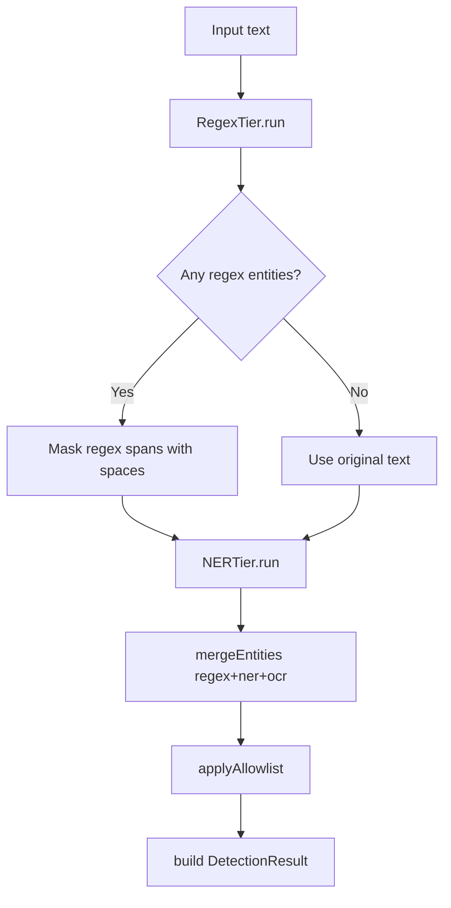

### 4.3 Tier class model

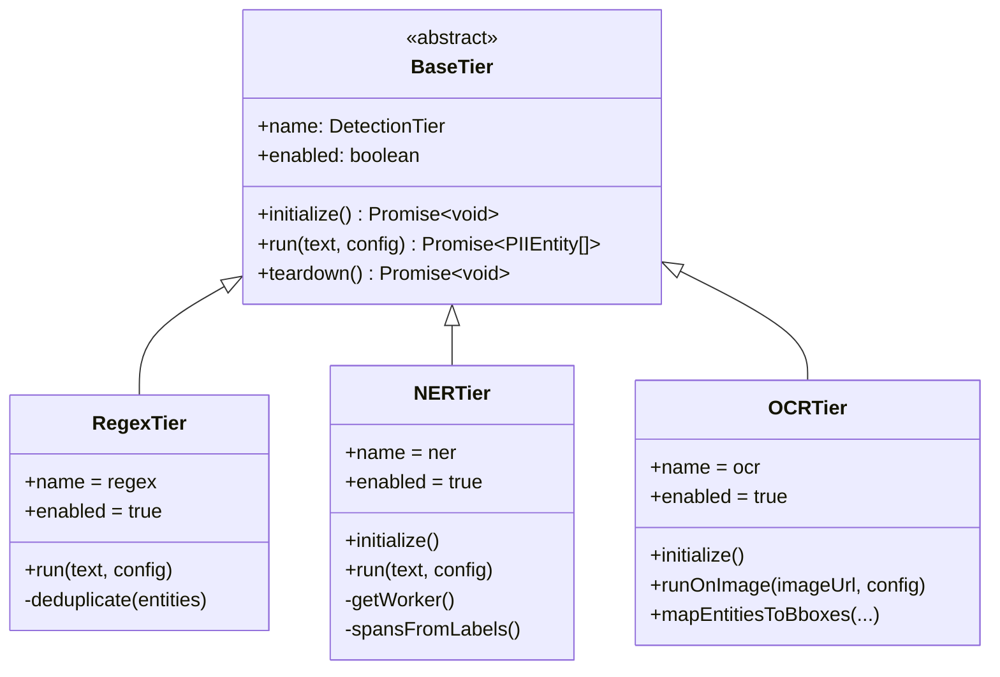

### 4.4 Rule engine and validators

- Rules are grouped by category (`financial`, `pii`, `confidential`, `ip`) and merged into `ALL_RULES`.
- Active rule filtering uses policy category enablement (`getActiveRules(config)`).
- Regex tier supports:
  - optional context triggers (`requireContext`, `triggers`),
  - optional validator hooks (`luhn`, `verhoeff`, `pan`),
  - allowlist skip at category config level.

### 4.5 NER runtime

- NER executes in worker (`src/workers/ner.worker.ts`) with `onnxruntime-web`.
- Worker initializes ONNX session with provider strategy (`webgpu` fallback to `wasm`).
- NER tier tokenizes input (`WordPieceTokenizer`) and posts inference requests with request IDs.
- Spans are reconstructed from labels and mapped to categories (`FINANCIAL`, `CONFIDENTIAL`, default `PII`).

### 4.6 OCR runtime

- OCR worker creation uses `tesseract.js` (`tiers/ocr/ocrWorker.ts`), with extension-aware asset paths.
- `runOnImage`:
  - first pass OCR,
  - optional sparse pass (PSM 11) for PAN recovery,
  - returns text + OCR token data + confidentiality-derived severity floor.
- `mapEntitiesToBboxes` maps text spans back to OCR words and attaches bbox arrays to entities.

### 4.7 Detection overlap strategy

`mergeEntities` precedence:

- tier priority: `regex < ner < ocr`
- for same-tier overlap: keep higher-confidence entity.

---

## 5. Backend architecture (`backend`)

## 5.1 Layered backend structure

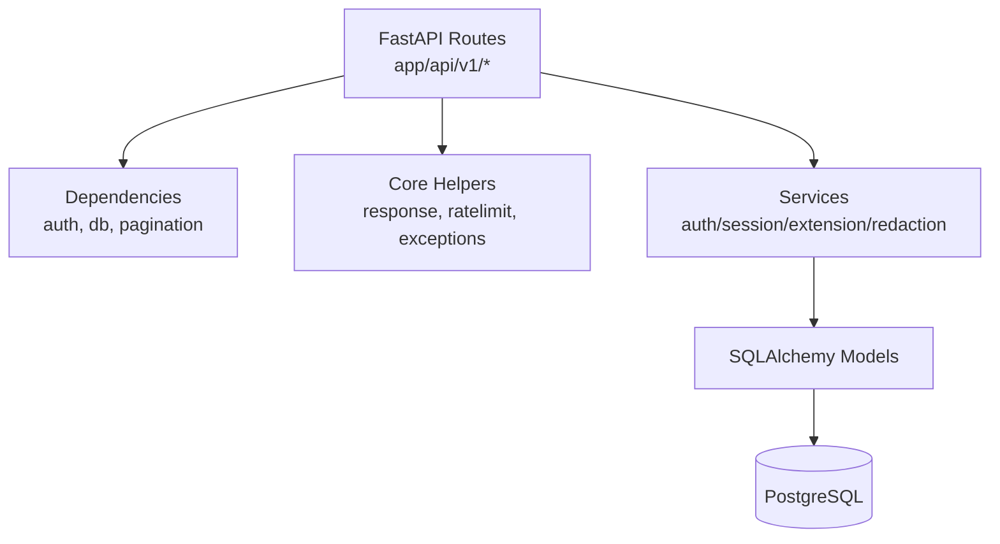

### 5.2 API surface

Top-level router: `app/api/v1/router.py`.

Included route groups:

- `auth`: Google OAuth + session user + logout
- `logs`: list/stats/dashboard/export
- `alerts`: alert stream and summary
- `policy`: versioned policy CRUD (user-owned)
- `devices`: register/list/heartbeat/delete
- `redaction`: PDF irreversible redaction
- `extension/policy`: extension polling endpoint
- `extension/log`: extension batch ingest endpoint

### 5.3 Session auth and fingerprint strategy

Authentication is session-cookie based (`sgpt_session`), no JWT.

Key implementation details:

- session rows in `models/session.py`,
- cookie helpers and validation in `services/session_service.py`,
- current-user dependency in `core/dependencies.py`,
- fingerprint hashing in `core/fingerprint.py`.

Special behavior:

- **lazy fingerprint binding**: sessions created in OAuth proxy callback start unbound and bind on first real browser request.
- **extension bypass**: requests with `X-Extension-Request: true` skip fingerprint matching (cookie still mandatory/validated).

### 5.4 OAuth callback and BFF cookie planting sequence

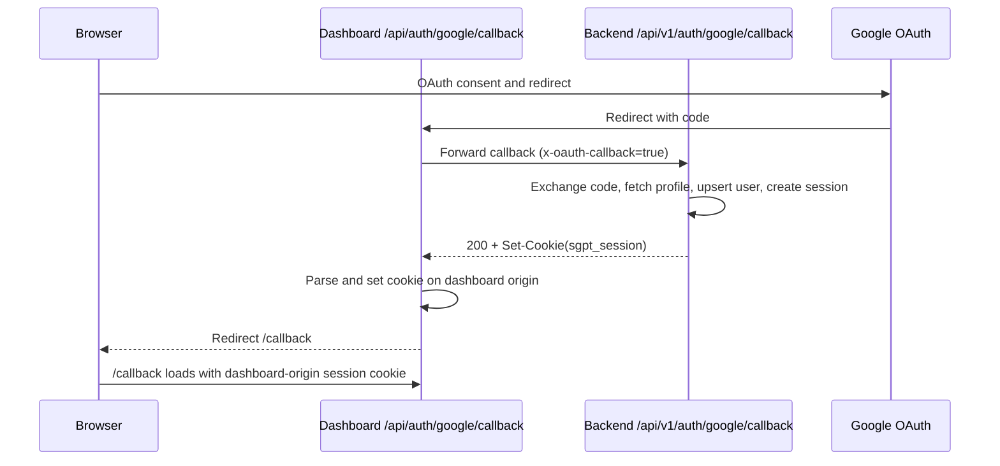

### 5.5 Standard response envelope and errors

`core/response.py` centralizes response shape:

- `success(data, message)`
- `paginated(data, page, page_size, total, message)`
- `error(code, message, details)`

`core/error_handlers.py` ensures:

- custom app exceptions map predictably,
- validation and HTTP exceptions normalized,
- unexpected exceptions never leak traceback to client.

### 5.6 Rate limiting

`core/ratelimit.py`:

- key function prefers `request.state.user_id`,
- unauthenticated fallback uses user-agent (not IP),
- per-endpoint limits declared as constants and applied per route.

### 5.7 Database model overview (ER-style)

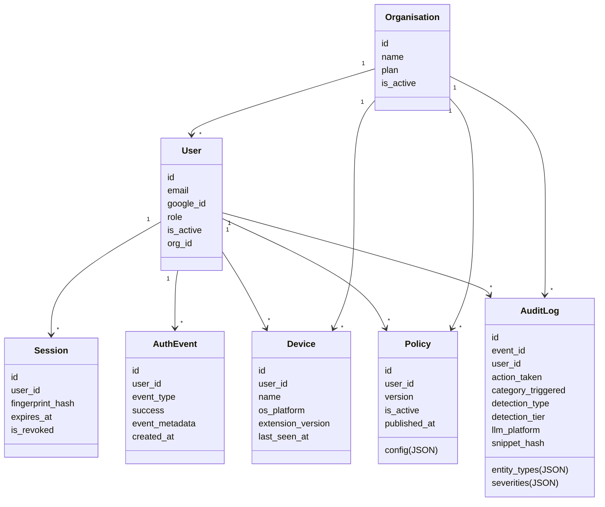

### 5.8 Extension ingestion path

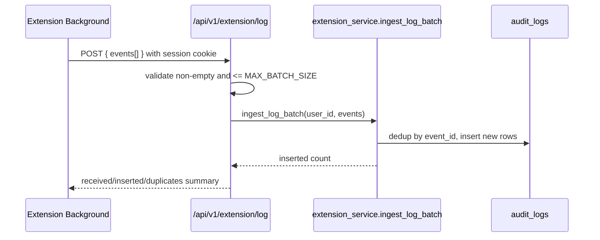

### 5.9 Policy synchronization path

- Extension polls `/api/v1/extension/policy`.
- Backend resolves active user policy from `policies` table.
- If none exists, backend returns default policy structure with current timestamps/version.

### 5.10 PDF redaction service

Redaction endpoint: `POST /api/v1/redact/pdf`.

Behavior:

1. parse region list,
2. store upload in temp dir,
3. rasterize PDF pages via `pdf2image`,
4. draw black rectangles using PIL,
5. rebuild image-only PDF (irreversible text-layer destruction),
6. return redacted file and schedule temp cleanup.

---

## 6. Dashboard architecture (`packages/secure-gpt-dashboard`)

## 6.1 App structure and state providers

- App Router (`src/app/*`) with auth and app route groups.
- Global providers in `app/layout.tsx`:
  - `AuthProvider`,
  - `ToastProvider`,
  - `ThemeProvider`,
  - `ModalProvider`.

### 6.2 Dashboard auth and proxy model

`src/proxy.ts` (Next proxy/middleware):

- allows public/auth callback/api paths,
- redirects unauthenticated navigation to `/login`,
- redirects authenticated `/login` visits to `/dashboard`.

`src/lib/api/client.ts`:

- uses relative `/api/v1` base URL,
- with credentials enabled,
- relies on Next rewrite from `next.config.ts`:
  `/api/v1/* -> ${BACKEND_URL}/api/v1/*`.

Result: browser always communicates same-origin with dashboard, while dashboard proxies backend API.

### 6.3 Dashboard-auth sequence

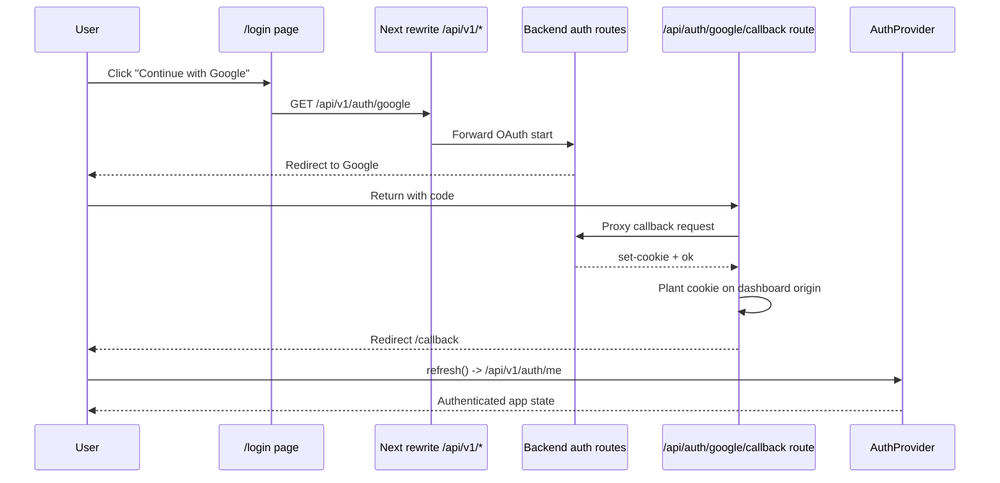

### 6.4 Dashboard feature-service mapping

- **Policy**: `features/policy/services/policy.service.ts` -> `/policy/current`.
- **Event logs**: `features/event-log/services/event-log.service.ts` -> `/logs`.
- **Alerts**: `features/alerts/services/alerts.service.ts` -> `/alerts`, `/alerts/summary`.
- **Dashboard metrics**: `features/dashboard/services/dashboard.service.ts` -> `/logs/dashboard`.

---

## 7. Shared contracts and cross-package consistency

`packages/shared` provides shared source of truth for:

- category/action constants (`constants/pii-categories.constants.ts`),
- platform/domain mappings (`constants/platforms.constants.ts`),
- masking token mappings (`constants/masking-tokens.constants.ts`),
- policy/detection/log/auth/api types (`types/*`),
- detection helper functions (`utils/detection-helpers.ts`).

This package is critical to prevent drift between extension, detection, and dashboard/backend payload assumptions.

---

## 8. UML state machine: submit decision lifecycle

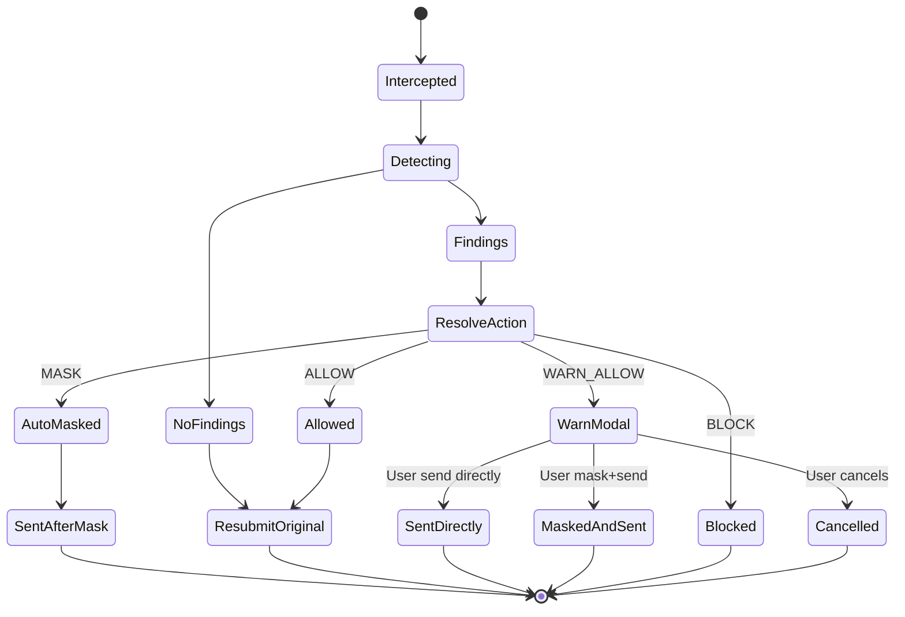

---

## 9. Data flow summary (what data goes where)

## 9.1 Local-only processing

- Raw prompt text, clipboard image data, PDF binary extraction, and OCR text are processed inside extension/offscreen runtime.
- Masking/redaction transformations happen before final submission.

## 9.2 Backend-bound data

- Session-auth requests for policy, logs, alerts, dashboard stats, device registration, and redaction service.
- Extension log payloads carry metadata and hashes (`snippetHash`) rather than raw sensitive values.

## 9.3 Audit semantics

- Extension generates `eventId` UUID per event.
- Backend deduplicates by `event_id`.
- Aggregation endpoints compute top platforms/domains/entity types and action counts.

---

## 10. Build and runtime composition

## 10.1 Extension build pipeline

- `build.mjs` runs Vite builds for popup/background/offscreen/content.
- Copies `public/` assets into `dist/`.
- Copies ONNX Runtime wasm binaries and PDF worker assets.
- Can inject Google client ID into built manifest.

## 10.2 Backend containerization

- `backend/Dockerfile` uses multi-stage build.
- Runtime includes `poppler-utils` for PDF rasterization dependency chain.
- Healthcheck uses `/health`.

## 10.3 Infra folder current state

`infra/docker-compose*.yml` and `infra/aws/*.json` files currently exist but are empty placeholders in this repository snapshot.

---

## 11. Key architectural decisions in code

1. **Session cookie auth over JWT**: centralized revocation/expiry checks and stronger server-side control.
2. **Lazy fingerprint binding**: avoids callback-context mismatch while preserving later anti-hijack verification.
3. **Extension fingerprint bypass via header**: avoids false positives from unstable service worker headers.
4. **Tiered detection with regex-first masking before NER**: reduces NER confusion from structured identifiers.
5. **Offscreen OCR/PDF execution**: isolates heavy parsing/OCR in extension-permitted context.
6. **Policy-driven behavior everywhere**: category enablement/actions/allowlist are runtime controls.
7. **Response envelope normalization**: predictable frontend consumption and unified error semantics.
8. **Dashboard same-origin proxying**: avoids cross-origin cookie/session breakage during auth and API use.

---

## 12. Operational caveats and extension points

- `Organisation` model exists as schema scaffold; most active flows are user-scoped.
- Some backend service modules are placeholders while route handlers carry active logic.
- OCR/NER paths are computationally heavier and rely on shipped model/wasm assets.
- Alerts severity filtering currently includes Python-side handling for JSON-array severity cases.

For major changes, keep cross-package contracts aligned:

- update `@securegpt/shared` types/constants first,
- propagate changes through extension/detection/dashboard/backend payload boundaries,
- preserve response envelope shape and session semantics.
