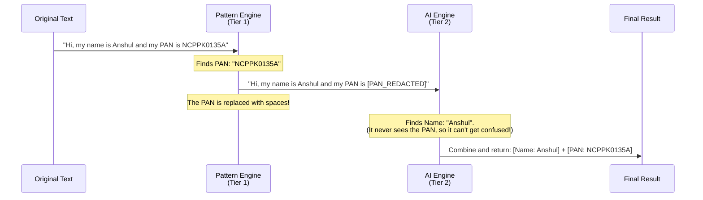

# How SecureGPT Detects Sensitive Data

## The Two-Step Approach
SecureGPT uses two different engines to find sensitive data (PII) to ensure both speed and accuracy.

1. **The Pattern Engine (Tier 1)**
   - **What it does:** Looks for strict, standard formats like Emails, Phone Numbers, PAN cards, and API Keys.
   - **Why it's good:** It is extremely fast and 100% accurate because these items have predictable shapes or math rules (like a credit card checksum).

2. **The AI Engine (Tier 2)**
   - **What it does:** Uses Artificial Intelligence to read sentences and understand context to find things like People's Names or Company Names.
   - **Why it's good:** It can spot sensitive data even when it doesn't follow a strict format.

---

## The Problem Previously
Originally, both engines read the text at the same time. This caused issues where the AI Engine would get confused by random letters and numbers (like an API Key) and mistakenly label them as a "Person's Name". 

## The Solution: Hide and Seek
To make the system bulletproof, we changed the order of operations:

1. **Find Patterns First:** The Pattern Engine scans the text and finds all the obvious, strict formats (like PAN cards and API keys).
2. **Hide the Patterns:** We temporarily replace those discovered items with blank spaces. This protects the exact structure of the sentence but hides the sensitive data.
3. **Send to AI:** We give this "blanked out" text to the AI Engine. Because the confusing API keys and ID numbers are hidden, the AI can focus purely on finding Names and Organizations without getting confused.
4. **Combine the Results:** We bring everything back together to provide a clean, perfectly accurate final result.

---

## Simple Visual Flow

---

## What About Complex Global Patterns (like Phone Numbers)?
You might wonder: *How do we handle phone numbers for every country in the world without making one giant, unreadable rule?*

Instead of an impossible global Regex, we use a **"Broad Net + Expert Judge"** approach:

1. **The Broad Net (Regex):** We write a simple, generic Regex that looks for things that *look* like phone numbers (e.g., 7 to 15 digits, maybe starting with a `+`, having spaces or dashes). 
2. **The Expert Judge (Validator):** Every time the Broad Net catches a potential number, we immediately pass it to a dedicated Phone Number Library validator (like `libphonenumber-js`). 
3. **The Verdict:** If the library confirms it's a valid phone number for a real country, we extract it. If not, we ignore it. 

This keeps the code clean and perfectly handles every country's dynamic phone number rules automatically!
