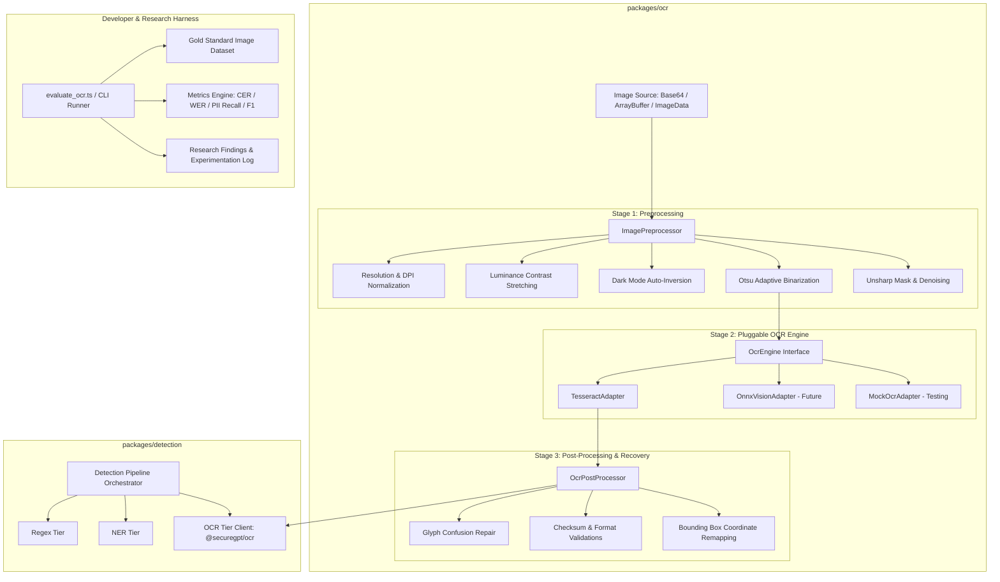

# Architectural Specification & Implementation Plan: `@securegpt/ocr` Modularization & Accuracy Benchmark Engine

## 1. Executive Summary & Problem Statement

Client-side Optical Character Recognition (OCR) is the first line of defense in SecureGPT for preventing sensitive data leaks in images, screenshots, ID cards, and clipboard snippets before prompt submission.

### Current Deficiencies:
1. **Monolithic Coupling**: OCR logic is embedded directly inside `@securegpt/detection/src/tiers/ocr/`, making it difficult to test, benchmark, or upgrade OCR algorithms without compiling the full detection pipeline.
2. **Fixed Thresholding**: Current image preprocessing applies a fixed global cutoff (`grayscale > 128`), which fails on low-contrast screenshots, dark mode UIs, colored badges, and gradient backgrounds.
3. **Engine Lock-In**: Tesseract.js is hardcoded without engine abstraction, preventing experimentation with alternative engines (e.g. quantized WebGPU ONNX vision models like TrOCR/Florence-2).
4. **Lack of OCR-Aware Error Recovery**: Common OCR glyph confusions (`0` $\leftrightarrow$ `O`, `1` $\leftrightarrow$ `I`/`l`, `5` $\leftrightarrow$ `S`) break strict regex and checksum validations for critical identifiers (PAN cards, Aadhaar numbers, Credit Cards).
5. **No Independent Evaluation Harness**: There is no automated quantitative harness measuring Character Error Rate (CER), Word Error Rate (WER), or PII detection recall specifically across image datasets.

---

## 2. Target Architecture



---

## 3. Package Structure: `packages/ocr`

```
packages/ocr/
├── package.json
├── tsconfig.json
├── src/
│   ├── index.ts                      # Public API exports
│   ├── types.ts                      # Engine, Preprocessing, and Result contracts
│   ├── preprocessor/
│   │   ├── imagePreprocessor.ts      # Orchestrator for image filter pipeline
│   │   ├── otsuThreshold.ts          # Pure-JS Otsu global & local adaptive binarization
│   │   ├── filters.ts                # Unsharp mask, contrast stretch, invert
│   │   └── canvasAdapter.ts          # Pure TypedArray / Canvas unified interface
│   ├── engines/
│   │   ├── engineInterface.ts        # Pluggable OcrEngine contract
│   │   ├── tesseractEngine.ts        # Tesseract.js implementation with PSM & DPI tuning
│   │   └── mockEngine.ts             # Deterministic mock engine for lightning-fast tests
│   ├── postprocessor/
│   │   ├── glyphRepair.ts            # Contextual character confusion substitution
│   │   ├── bboxMapper.ts             # High-precision bounding box remapping
│   │   └── signals.ts                # Levenshtein fuzzy keyword classification
│   └── pipeline/
│       └── ocrPipeline.ts            # End-to-end 3-stage execution coordinator
├── dataset/
│   ├── images/                       # Labeled test images (ID cards, screenshots, dark mode)
│   └── ground_truth.jsonl            # Ground truth annotations (transcription + PII spans)
├── scripts/
│   └── evaluate_ocr.ts               # Standalone evaluation & accuracy reporting CLI
└── tests/
    ├── preprocessor.test.ts
    ├── glyphRepair.test.ts
    └── ocrPipeline.test.ts
```

---

## 4. Technical Design Specifications

### 4.1. Universal Image Preprocessor (Node & Browser Compatible)
* **Pure TypedArray Algorithms**: Implements grayscale luminance, histogram calculation, Otsu's optimal threshold selection, and dark-mode detection using `Uint8ClampedArray` (Raw RGB/RGBA buffers).
* **Zero Native Dependency**: Works seamlessly in Node.js test environments, Vitest, and browser offscreen documents without requiring compiled C++ `node-canvas` binaries.
* **Auto-Orientation**: Detects landscape vs. portrait aspect ratios and performs deskew/rotation fallback passes (0°, 90°, 180°, 270°).

### 4.2. Pluggable OCR Engine Interface
```typescript
export interface OcrEngine {
  readonly name: string;
  initialize(): Promise<void>;
  recognize(image: ImageData | string, options?: OcrEngineOptions): Promise<OcrEngineResult>;
  setParameters(params: Record<string, any>): Promise<void>;
  terminate(): Promise<void>;
}
```

### 4.3. Post-OCR Glyph Confusion & Checksum Recovery
For high-value structured identifiers (Aadhaar, PAN, Credit Cards, IPv4, Phone Numbers):
1. **Candidate Extraction**: Extracts candidate tokens matching relaxed patterns where digits and confusing letters are interchangeable (e.g. `[0-9OISLZBQG]` for numbers).
2. **Contextual Substitution**: Systematically generates digit-repaired candidates.
3. **Mathematical Verification**: Validates candidates against standard check digit algorithms (Verhoeff for Aadhaar, Luhn for Credit Cards, strict regex for PAN structure). Only candidates that satisfy mathematical checksums are accepted.

---

## 5. Evaluation Harness & Research Experimentation Paper Structure

The evaluation harness (`packages/ocr/scripts/evaluate_ocr.ts`) will output a standardized benchmark report and maintain a research documentation log at `secure-gpt/docs/ocr-accuracy-experiments.md`.

### Evaluation Metrics:
1. **Character Error Rate (CER)**:
   $$\text{CER} = \frac{S + D + I}{N} = \frac{\text{Substitutions} + \text{Deletions} + \text{Insertions}}{\text{Total Reference Characters}}$$
2. **Word Error Rate (WER)**:
   $$\text{WER} = \frac{S_w + D_w + I_w}{N_w}$$
3. **PII Detection Recall & Precision**:
   $$\text{Recall} = \frac{\text{True Positives}}{\text{True Positives} + \text{False Negatives}},\quad \text{Precision} = \frac{\text{True Positives}}{\text{True Positives} + \text{False Positives}}$$
4. **Latency Benchmark**: Average execution time per stage (Preprocessing vs Inference vs Postprocessing).

---

## 6. Phased Implementation Plan

### Phase 1: Scaffolding `@securegpt/ocr`
- Set up `packages/ocr/package.json`, `tsconfig.json`, and monorepo workspace dependencies.
- Define core interfaces (`OcrEngine`, `OcrResult`, `PreprocessingOptions`, `BoundingBox`).

### Phase 2: Subsystem Implementation
- **Preprocessing**: Implement Otsu's thresholding, contrast stretching, dark mode auto-inversion, and unsharp masking.
- **Engine Layer**: Build `TesseractEngine` with `user_defined_dpi: '300'`, `preserve_interword_spaces: '1'`, and `MockEngine`.
- **Postprocessing**: Build `glyphRepair.ts` with Verhoeff/Luhn validation and bounding box coordinate remapping.
- **Pipeline**: Build `OcrPipeline` composing the three stages.

### Phase 3: Orchestration & Upstream Integration
- Connect `@securegpt/detection`'s `OCRTier` and `@securegpt/extension`'s offscreen document to `@securegpt/ocr`.
- Verify full monorepo typechecking (`npm run typecheck`) and Vitest test suite (`npm run test:all`).

### Phase 4: Evaluation Benchmark & Research Experimentation Doc
- Build `evaluate_ocr.ts` CLI tool.
- Populate ground-truth image dataset.
- Generate and publish `docs/ocr-accuracy-experiments.md` documenting experimental results, baseline vs. upgraded accuracy, and future research directions.
